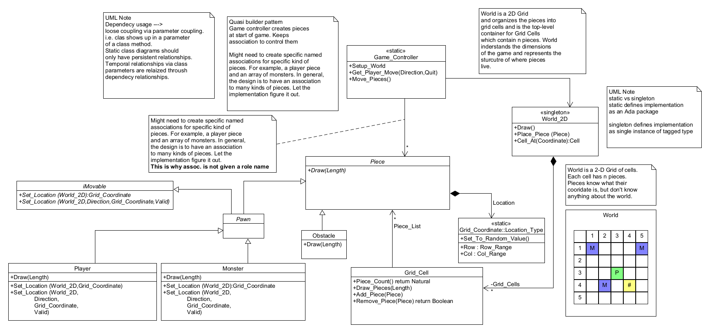

# Summary
Pieces are main elements of game. The board is a grid of cells and pieces live on cells.
The game controller provides methods to move a player and then cause monsters to move in
a 'turn-based' design.

Board is setup by controller using random selection of obstacles and monsters.

# Details

## Architecture

